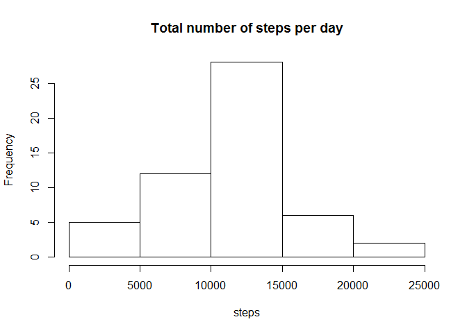
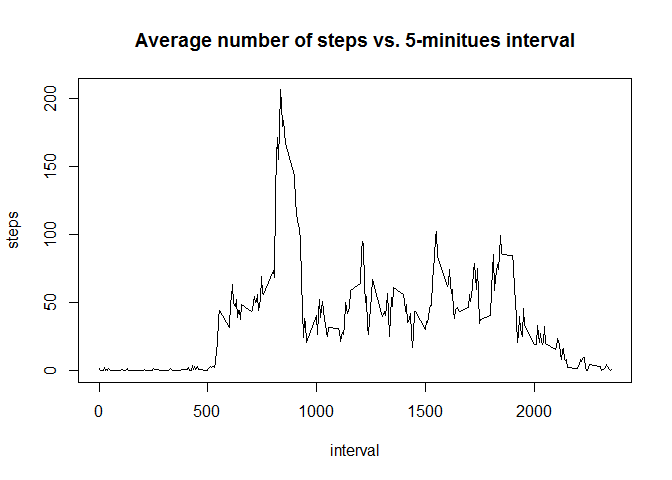
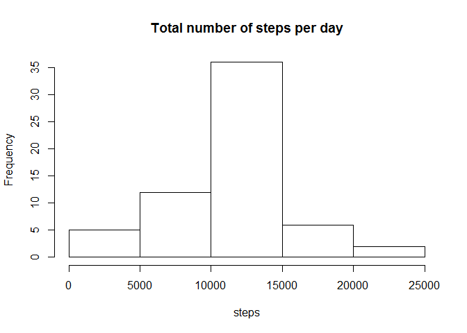
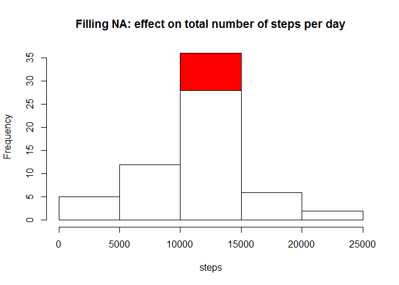
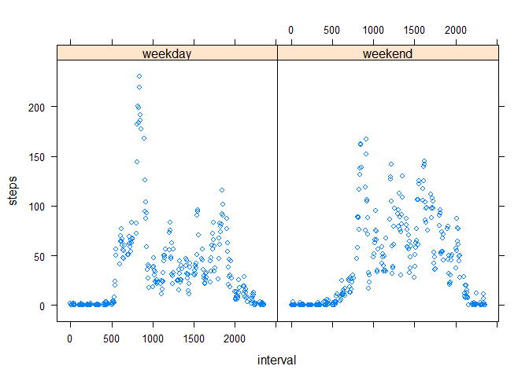

# Reproducible research - assignment 1
Monday, October 17, 2014  

### Loading data
Loading data from .csv file
(Day, progressive number indicating the intra-day time interval, number of steps)

```r
data <- read.csv(unz("activity.zip", "activity.csv"))
```

### Exploring data
Make a histogram of the total number of steps taken each day

```r
stepsDay <- aggregate (steps~date, data=data, FUN=sum)
with (stepsDay, hist(steps, main="Total number of steps per day"))
```

 

Calculate and report the mean and median total number of steps taken per day

```r
mean (stepsDay$steps, na.rm=TRUE);
```

```
## [1] 10766.19
```

```r
median (stepsDay$steps, na.rm=TRUE);
```

```
## [1] 10765
```

Time series plot of the 5-minute interval and the average number of steps taken, averaged across all days.

```r
stepsInterval <- aggregate (steps~interval, data=data, FUN=mean)
plot (stepsInterval, type="l")
title ("Average number of steps vs. 5-minitues interval")
```

 

Which 5-minute interval, on average across all the days in the dataset, contains the maximum number of steps?

```r
stepsInterval[which.max(stepsInterval$steps),1]
```

```
## [1] 835
```

### Dealing with missing values 'NA'
The total number of missing values in the dataset is 2304
(13.1147541%)

Replacing missing values with the average number of steps for the corresponding 5-minute interval

```r
data[which (is.na (data$steps)),]$steps <- 
stepsInterval[match (data[which (is.na (data$steps)),]$interval, stepsInterval$interval),]$steps
```

The total number of missing values in the dataset is now 0
(0%)

### Exploring new data
Make a histogram of the total number of steps taken each day

```r
stepsDay2 <- aggregate (steps~date, data=data, FUN=sum)
with (stepsDay2, hist (steps, main="Total number of steps per day"))
```

 


### Effects of filling missing values
Calculate and report the mean and median total number of steps taken per day

```r
mean (stepsDay2$steps);
```

```
## [1] 10766.19
```

```r
median (stepsDay2$steps);
```

```
## [1] 10766.19
```

Having rapleced missing values with average values,
the mean total number of steps is not affected
as opposed to the median, because the actual list of numbers changed.

Another consequence of replacing missing values is that the
total number of steps per day increases, because numbers are added.
Still, adding means do not change the mean of the numbers already present
because the number of observations also increases.


```r
with(stepsDay2, hist(steps, main="Filling NA: effect on total number of steps per day", col="red"))
hist(stepsDay$steps, col="white", add=TRUE)
```

 

### Comparing weekday and weekend
Create a new factor variable in the dataset with two levels - "weekday" and "weekend" indicating whether a given date is a weekday or weekend day.
(using 'wday' instead of 'weekdays' to handle numbers instead of names of days that differ in different languages)

```r
require(lubridate)
```

```
## Loading required package: lubridate
```

```r
data$week <- as.factor(ifelse(wday(as.Date(data$date, "%Y-%m-%d")) %in% c(2:6), "weekday", "weekend"))
stepsInterval2 <- aggregate (steps~interval+week, data=data, FUN=mean)
library(lattice)
with(stepsInterval2, xyplot(steps~interval|week))
```

 

